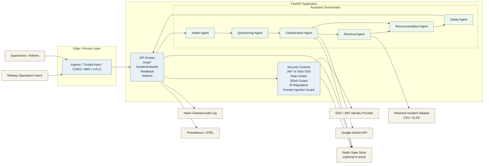
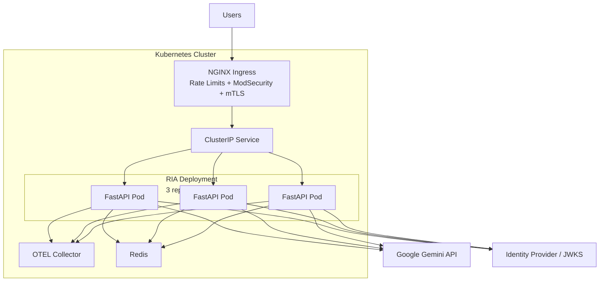

# Architecture Diagram

## Runtime Architecture

## Production Deployment View

## Notes

- The app can run with in-memory state locally, but production manifests point to Redis.
- Classification is the only agent step that depends on Gemini; retrieval and policy evaluation remain local.
- Audit logging is append-only and hash-chained to support integrity verification.
